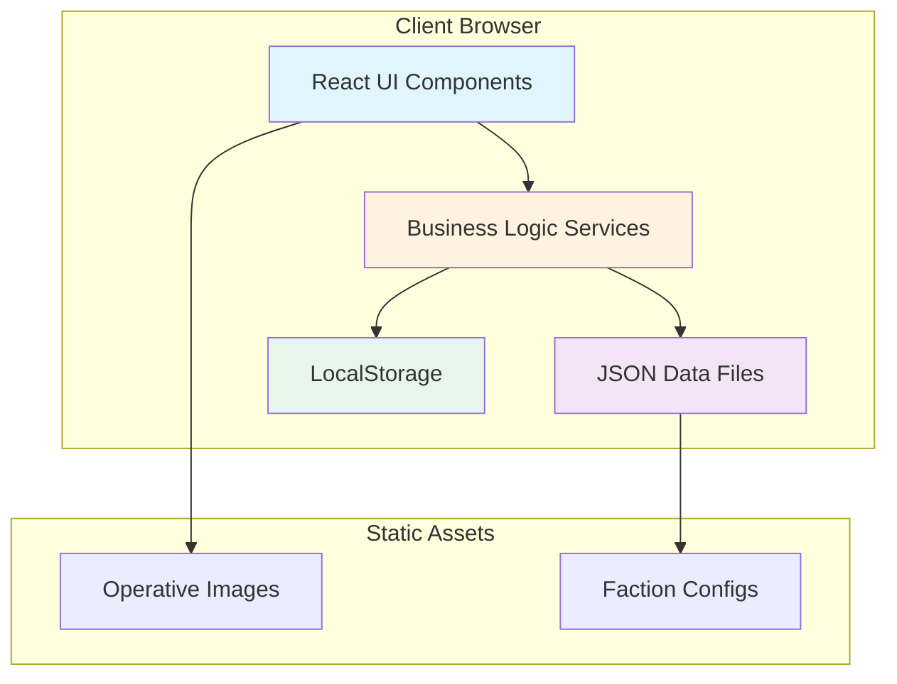
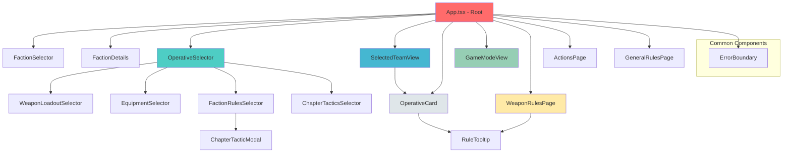
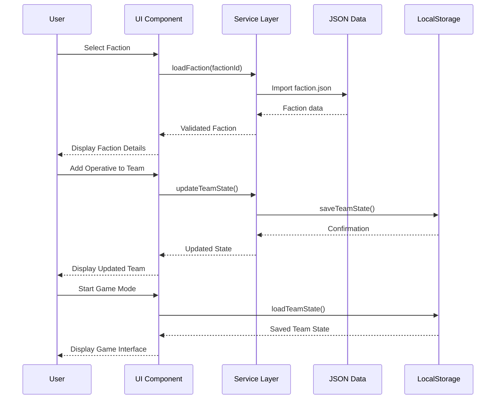
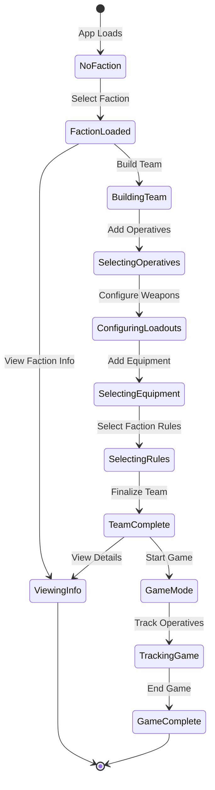
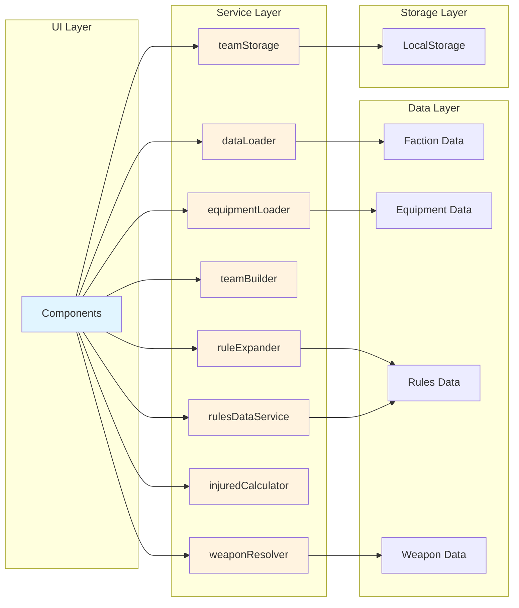
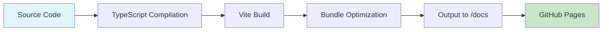

# Kill Team Dataslate - Architecture Documentation

## Table of Contents

1. [System Overview](#system-overview)
2. [Architecture Diagrams](#architecture-diagrams)
3. [Component Architecture](#component-architecture)
4. [Data Flow](#data-flow)
5. [Service Layer](#service-layer)
6. [State Management](#state-management)
7. [Type System](#type-system)
8. [File Structure](#file-structure)
9. [Key Design Patterns](#key-design-patterns)
10. [Testing Strategy](#testing-strategy)

## System Overview

Kill Team Dataslate is a client-side React application built with TypeScript and Vite. It provides comprehensive tools for Warhammer 40K Kill Team players to view faction rules, build teams, and track game state.

### Technology Stack

- **Frontend Framework**: React 18+ with TypeScript (strict mode)
- **Build Tool**: Vite 5
- **Testing**: Vitest + React Testing Library
- **Styling**: CSS Modules
- **Deployment**: GitHub Pages (static hosting)

### Key Characteristics

- **Fully Client-Side**: No backend server required
- **Data-Driven**: All game data stored in JSON configuration files
- **Type-Safe**: Comprehensive TypeScript type system
- **Tested**: 190+ unit tests with high coverage
- **Responsive**: Mobile-first design approach
- **Accessible**: WCAG 2.1 AA compliance

## Architecture Diagrams

### System Architecture



### Component Hierarchy



### Data Flow Architecture



### State Management Flow



### Service Layer Interactions



## Component Architecture

### Core Components

#### App Component (`App.tsx`)

The root component that manages:
- Global application state
- View mode navigation (home, game mode, rules pages)
- Team building workflow
- Faction selection and loading

**Key Responsibilities:**
- Orchestrates view transitions
- Manages team state and persistence
- Loads faction and equipment data
- Provides context to child components

#### Faction Components

**FactionSelector** (`components/faction/FactionSelector.tsx`)
- Displays available factions
- Handles faction selection
- Shows faction metadata

**FactionDetails** (`components/faction/FactionDetails.tsx`)
- Displays comprehensive faction information
- Shows faction-specific rules
- Lists available operatives
- Renders operative datacards

#### Team Building Components

**OperativeSelector** (`components/team/OperativeSelector.tsx`)
- Lists available operatives for selected faction
- Handles operative addition to team
- Filters operatives by type
- Integrates weapon and equipment selection

**WeaponLoadoutSelector** (`components/team/WeaponLoadoutSelector.tsx`)
- Shows available weapons for an operative
- Handles weapon selection
- Displays weapon profiles and rules

**EquipmentSelector** (`components/equipment/EquipmentSelector.tsx`)
- Lists available equipment
- Handles equipment assignment to operatives
- Shows equipment costs and effects

**FactionRulesSelector** (`components/team/FactionRulesSelector.tsx`)
- Allows selection of faction-specific rules
- Handles Chapter Tactics for Space Marines
- Manages rule validation

**SelectedTeamView** (`components/team/SelectedTeamView.tsx`)
- Displays current team composition
- Shows selected operatives with loadouts
- Allows editing and removal of operatives
- Provides team summary

#### Datacard Components

**OperativeCard** (`components/datacard/OperativeCard.tsx`)
- Renders complete operative datacard
- Shows stats (M, APL, GA, DF, SV, W)
- Displays weapons with profiles
- Shows abilities and keywords
- Includes operative image
- Supports interactive rule expansion

#### Game Components

**GameModeView** (`components/game/GameModeView.tsx`)
- Main game tracking interface
- Manages turning point progression
- Tracks command points

**GameManagement** (`components/game/GameManagement.tsx`)
- Individual operative tracking
- Wound management
- Status effects
- Activation tracking

#### Rules Components

**WeaponRulesPage** (`components/rules/WeaponRulesPage.tsx`)
- Comprehensive weapon rules glossary
- Searchable and filterable
- Shows expanded rule descriptions

**ActionsPage** (`components/rules/ActionsPage.tsx`)
- Lists all game actions
- Shows action costs and requirements
- Provides detailed descriptions

**GeneralRulesPage** (`components/rules/GeneralRulesPage.tsx`)
- General game rules reference
- Core mechanics explanations
- Searchable rules database

**RuleTooltip** (`components/rules/RuleTooltip.tsx`)
- Interactive tooltip component
- Shows expanded rule text on hover/click
- Used throughout the application

#### Common Components

**ErrorBoundary** (`components/common/ErrorBoundary.tsx`)
- Catches and handles React errors
- Provides graceful error UI
- Prevents full application crashes

## Data Flow

### Faction Loading Flow

1. User selects faction from `FactionSelector`
2. `App` calls `loadFaction(factionId)` from `dataLoader` service
3. Service dynamically imports faction JSON from `/src/data/factions/{factionId}/`
4. Data is validated against TypeScript types
5. Faction state is updated in `App`
6. `FactionDetails` receives faction data via props
7. Operative cards are rendered with complete data

### Team Building Flow

1. User adds operative from `OperativeSelector`
2. Component generates unique selection ID
3. Default weapons are assigned
4. User customizes loadout via `WeaponLoadoutSelector`
5. User adds equipment via `EquipmentSelector`
6. Team state is updated in `App`
7. `teamStorage` service saves to LocalStorage
8. `SelectedTeamView` displays updated team
9. Validation runs via `teamBuilder` service

### Game Tracking Flow

1. User enters game mode via navigation
2. `GameModeView` loads saved team state
3. Game state initializes (turning point 1, full CP)
4. User interacts with `GameManagement` for operatives
5. Wounds, activations, and status tracked
6. `injuredCalculator` determines injured status
7. State persists to LocalStorage
8. UI updates reactively

## Service Layer

### dataLoader (`services/dataLoader.ts`)

**Purpose**: Load and validate faction data

**Key Functions**:
- `loadFaction(factionId)`: Load specific faction
- `loadAllFactions()`: Load all available factions
- `getFactionList()`: Get faction metadata list

**Dependencies**: Faction JSON files

### equipmentLoader (`services/equipmentLoader.ts`)

**Purpose**: Load universal equipment data

**Key Functions**:
- `loadUniversalEquipment()`: Load all equipment

**Dependencies**: Equipment JSON files

### ruleExpander (`services/ruleExpander.ts`)

**Purpose**: Expand rule abbreviations to full text

**Key Functions**:
- `expandWeaponRule(rule)`: Expand weapon special rule
- `expandAbility(ability)`: Expand ability text

**Dependencies**: Rules data

### teamBuilder (`services/teamBuilder.ts`)

**Purpose**: Team composition validation and management

**Key Functions**:
- `validateTeam(team)`: Validate team rules
- `canAddOperative(team, operative)`: Check if operative can be added
- `getTeamPoints(team)`: Calculate team cost

**Dependencies**: Faction rules, operative data

### teamStorage (`services/teamStorage.ts`)

**Purpose**: Persist team state to LocalStorage

**Key Functions**:
- `saveTeamState(state)`: Save current team
- `loadTeamState()`: Load saved team
- `clearTeamState()`: Clear saved data
- `getInitialTeamState()`: Get default state

**Dependencies**: LocalStorage API

### weaponResolver (`services/weaponResolver.ts`)

**Purpose**: Resolve weapon profiles and data

**Key Functions**:
- `resolveWeapon(weaponId)`: Get full weapon data
- `getWeaponOptions(operative)`: Get available weapons

**Dependencies**: Weapon data

### injuredCalculator (`services/injuredCalculator.ts`)

**Purpose**: Calculate operative injured status

**Key Functions**:
- `isInjured(operative, currentWounds)`: Check if injured
- `getInjuredThreshold(operative)`: Get injured threshold

**Dependencies**: Operative stats

### rulesDataService (`services/rulesDataService.ts`)

**Purpose**: Access general rules data

**Key Functions**:
- `getActions()`: Get all actions
- `getGeneralRules()`: Get general rules
- `searchRules(query)`: Search rules

**Dependencies**: Rules JSON files

## State Management

### State Structure

The application uses React's built-in state management with `useState` and `useEffect` hooks. State is primarily managed in the root `App` component and passed down via props.

#### Primary State Objects

**TeamState**:
```typescript
interface TeamState {
  factionId: string | null;
  selectedOperatives: SelectedOperative[];
  factionRules: SelectedFactionRule[];
  turnCounter: number;
}
```

**SelectedOperative**:
```typescript
interface SelectedOperative {
  selectionId: string;
  operative: Operative;
  selectedWeapons: Weapon[];
  equipment: Equipment[];
  currentWounds: number;
  activated: boolean;
}
```

### State Persistence

- Team state is automatically saved to LocalStorage on every change
- State is restored on application load
- Game state persists across browser sessions
- Clear state function available for reset

### State Flow Patterns

1. **Unidirectional Data Flow**: State flows down from `App` to child components
2. **Event Bubbling**: User actions bubble up via callback props
3. **Immutable Updates**: State updates use spread operators and array methods
4. **Effect Synchronization**: `useEffect` hooks sync state with external systems

## Type System

### Core Type Definitions

Located in `src/types/`:

#### faction.ts
- `Faction`: Complete faction definition
- `FactionRule`: Faction-specific rules
- `TeamRestrictions`: Team building constraints

#### operative.ts
- `Operative`: Operative definition
- `OperativeStats`: Core stats (M, APL, GA, DF, SV, W)
- `OperativeType`: Trooper, Leader, etc.

#### weapon.ts
- `Weapon`: Weapon definition
- `WeaponProfile`: Specific weapon configuration
- `WeaponRule`: Special rules (Piercing, Lethal, etc.)

#### ability.ts
- `Ability`: Operative ability
- `AbilityType`: Action, passive, unique

#### equipment.ts
- `Equipment`: Equipment item definition
- `EquipmentType`: Classification

#### team.ts
- `TeamState`: Application team state
- `SelectedOperative`: Operative in team
- `SelectedFactionRule`: Applied faction rule

#### game.ts
- `GameState`: Full game tracking state
- `TurningPoint`: Game phase tracking

### Type Safety Benefits

- Compile-time error checking
- IDE autocomplete support
- Refactoring confidence
- Self-documenting code
- Reduced runtime errors

## File Structure

```
/
├── src/
│   ├── components/          # React UI components
│   │   ├── common/         # Shared/reusable components
│   │   ├── datacard/       # Operative datacard components
│   │   ├── equipment/      # Equipment selection components
│   │   ├── faction/        # Faction selection/display
│   │   ├── game/           # Game tracking components
│   │   ├── rules/          # Rules reference components
│   │   └── team/           # Team building components
│   │
│   ├── data/               # Static configuration data
│   │   ├── constants/      # Game constants
│   │   ├── equipment/      # Equipment definitions
│   │   ├── factions/       # Faction data (JSON)
│   │   │   ├── angels-of-death/
│   │   │   └── plague-marines/
│   │   ├── rules/          # General rules data
│   │   └── weapons/        # Weapon definitions
│   │
│   ├── services/           # Business logic services
│   │   ├── dataLoader.ts
│   │   ├── equipmentLoader.ts
│   │   ├── injuredCalculator.ts
│   │   ├── ruleExpander.ts
│   │   ├── rulesDataService.ts
│   │   ├── teamBuilder.ts
│   │   ├── teamStorage.ts
│   │   └── weaponResolver.ts
│   │
│   ├── types/              # TypeScript type definitions
│   │   ├── ability.ts
│   │   ├── equipment.ts
│   │   ├── faction.ts
│   │   ├── game.ts
│   │   ├── index.ts        # Barrel export
│   │   ├── operative.ts
│   │   ├── team.ts
│   │   └── weapon.ts
│   │
│   ├── App.tsx             # Root application component
│   ├── App.css             # Global app styles
│   ├── main.tsx            # Application entry point
│   ├── index.css           # Global CSS reset/base
│   ├── constants.ts        # Application constants
│   ├── version.ts          # Version information
│   └── vite-env.d.ts       # Vite type declarations
│
├── tests/
│   ├── unit/               # Unit tests
│   │   ├── *.test.ts       # Service tests
│   │   └── *.test.tsx      # Component tests
│   └── setup.ts            # Test configuration
│
├── public/
│   └── images/
│       └── operatives/     # Operative images by faction
│
├── docs/                   # Build output (GitHub Pages)
├── scripts/                # Build and utility scripts
└── tools/                  # Development tools
```

## Key Design Patterns

### 1. Component Composition

Components are composed hierarchically with clear separation of concerns:
- **Container Components**: Manage state and logic (e.g., `App`, `OperativeSelector`)
- **Presentation Components**: Focus on UI rendering (e.g., `OperativeCard`)
- **Utility Components**: Provide reusable functionality (e.g., `RuleTooltip`)

### 2. Service Layer Pattern

Business logic is extracted into service modules:
- Pure functions for data transformation
- Clear interfaces and responsibilities
- Testable in isolation
- Reusable across components

### 3. Data-Driven Configuration

Game data is stored in JSON files:
- Version-controlled faction data
- Schema-validated configurations
- Easy to update without code changes
- Supports modular faction additions

### 4. Props Drilling with Callbacks

State management uses props drilling pattern:
- State owned by parent components
- Passed down via props
- Modified via callback functions
- Simple and explicit data flow

### 5. Error Boundaries

React error boundaries catch and handle errors:
- Prevent full app crashes
- Provide user-friendly error messages
- Enable graceful degradation
- Logged for debugging

### 6. CSS Modules

Component-scoped styling:
- Prevents style conflicts
- Co-located with components
- Type-safe class names
- Easy to maintain

### 7. Dependency Injection

Services receive dependencies as parameters:
- Easier testing with mocks
- Flexible and maintainable
- Explicit dependencies
- Supports different environments

## Testing Strategy

### Test Coverage

- **190+ unit tests** covering core functionality
- Target: 80%+ code coverage
- Focus on critical business logic

### Test Categories

#### 1. Service Tests
- Data loading and validation
- Rule expansion logic
- Team building validation
- Weapon resolution
- Injured calculations
- State persistence

#### 2. Component Tests
- Component rendering
- User interactions
- Props validation
- Edge cases
- Accessibility

#### 3. Integration Tests
- Faction data loading workflows
- Team building end-to-end
- Complete operative selection flow

### Testing Tools

- **Vitest**: Fast unit test runner
- **React Testing Library**: Component testing
- **@testing-library/jest-dom**: DOM matchers
- **@testing-library/user-event**: User interaction simulation

### Testing Best Practices

1. **Test Behavior, Not Implementation**: Focus on what users see and do
2. **Use Semantic Queries**: Prefer `getByRole`, `getByLabelText`
3. **Mock External Dependencies**: Isolate units under test
4. **Keep Tests Focused**: One concept per test
5. **Descriptive Test Names**: Clear test intentions
6. **Arrange-Act-Assert**: Consistent test structure

### Running Tests

```bash
npm run test              # Run all tests
npm run test:ui          # Interactive test UI
npm run test:coverage    # Generate coverage report
```

## Performance Considerations

### Optimization Strategies

1. **Code Splitting**: Faction data loaded on-demand
2. **Lazy Loading**: Images loaded as needed
3. **Memoization**: Expensive calculations cached
4. **CSS Modules**: Efficient scoped styles
5. **Vite Build**: Optimized production bundles

### Performance Targets

- First Contentful Paint: < 1.5s
- Time to Interactive: < 3.5s
- Lighthouse Score: 90+

## Security Considerations

1. **No Server-Side Code**: Reduced attack surface
2. **Client-Side Validation**: Input sanitization
3. **Type Safety**: Prevents type-related bugs
4. **No Secrets**: No API keys or sensitive data
5. **Content Security**: GitHub Pages HTTPS

## Deployment Architecture

### Build Process



### CI/CD Pipeline

1. **Type Check**: Verify TypeScript types
2. **Lint**: Check code quality
3. **Format**: Validate code formatting
4. **Test**: Run all tests
5. **Build**: Create production bundle
6. **Deploy**: Upload to GitHub Pages

### Deployment Configuration

- **Output Directory**: `/docs` (for GitHub Pages)
- **Base Path**: `/wh40k-killteamtools/`
- **Build Command**: `npm run build`
- **Node Version**: 18.0.0+

## Future Architecture Considerations

### Potential Enhancements

1. **State Management Library**: Redux or Zustand for complex state
2. **Service Worker**: Offline support and caching
3. **Progressive Web App**: Mobile app capabilities
4. **WebAssembly**: Performance-critical calculations
5. **Backend Integration**: User accounts and cloud sync
6. **Real-Time Features**: Multiplayer game tracking

### Scalability Considerations

- Modular architecture supports feature additions
- Service layer can be extended
- Component library can grow
- Data format supports new factions
- Type system ensures refactoring safety

## Conclusion

The Kill Team Dataslate architecture emphasizes simplicity, type safety, and maintainability. The modular design with clear separation of concerns enables incremental feature development while maintaining code quality. The comprehensive type system and testing strategy ensure reliability and ease of refactoring.

Key architectural strengths:
- **Simple**: Client-side only, minimal complexity
- **Type-Safe**: Comprehensive TypeScript coverage
- **Testable**: High test coverage, isolated services
- **Maintainable**: Clear structure, well-documented
- **Extensible**: Easy to add new factions and features
- **Performant**: Optimized builds, efficient loading

This architecture provides a solid foundation for current functionality and future enhancements.
